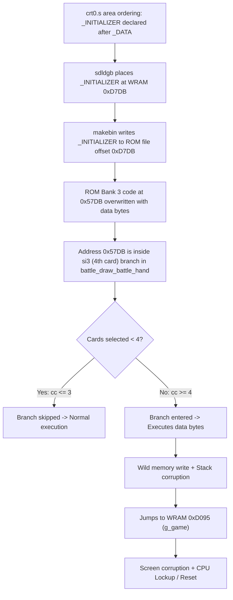

# Root-Cause Analysis & Implementation Plan: 4-Card Battle Selection Corruption & Crash

## 1. Problem Description

When selecting a 4th card in battle (forming a 4-card selection or combo such as a Two Pair or 4-of-a-Kind), the Game Boy screen corrupts completely with garbage/blank tiles, and the game frequently locks up or resets.

---

## 2. Root-Cause Analysis

### 2.1 The Linker & Memory Layout Overlap
In `src/crt0.s`, the linker memory areas were declared in the following order:
```asm
        .area   _HOME
        .area   _DATA
__cpu:  .ds     1
...
        .area   _INITIALIZED
        .area   _INITIALIZER
        .area   _BSS
        .area   _GSINIT
        .area   _GSFINAL
        .area   _HEAP
        .area   _HEAP_END
        .area   _LIT
```

`sdldgb` assigns area addresses sequentially in the order they are first defined in the linked object files (`crt0.o` is linked first). Because `_INITIALIZER`, `_GSINIT`, `_GSFINAL`, and `_LIT` were declared **after** `_DATA` (which is pinned at `0xC940`), `sdldgb` treated `_INITIALIZER` as a RAM section located immediately after `_INITIALIZED`:
* In the release build: `0xD7DB - 0xD805` (43 bytes)
* In the debug build: `0xDCE1 - 0xDD11` (48 bytes)

When `makebin` (the GBDK tool that translates the linked `.ihx` Intel HEX output into a `.gb` ROM file) converted the output:
1. `makebin` interpreted the records at `0xD7DB` as ROM file offsets.
2. In a Game Boy 32KB/multi-bank layout, file offset `0xC000..0xFFFF` is **ROM Bank 3** (mapped to CPU address `0x4000..0x7FFF` when bank 3 is active).
3. Therefore, file offset `0xD7DB` directly overlaps CPU address `0x4000 + (0xD7DB - 0xC000) = 0x57DB` in **ROM Bank 3**.
4. During linking, `makebin` gave warnings:
   ```text
   Warning: Multiple write of 2 bytes at 0xd7db -> 0xd7dc writes:(0xd7db -> 0xd7dc, 0xd0a8 -> 0xdc36)
   ...
   ```
5. `makebin` overwrote the machine code of ROM Bank 3 at `0x57DB..0x5805` with the byte contents of `_INITIALIZER` (`00 00 00 02 00 00 ...`).

---

### 2.2 Why Does It Trigger Specifically on the 4th Selected Card?

ROM Bank 3 houses `src/ui/ui_battle_content.c` (`ui_update_battle_banked`). Inside `ui_battle_content.c`, function `battle_draw_battle_hand` contains:

```c
    uint8_t cc   = battle->combo_count;
    uint8_t si0  = (cc > 0) ? battle->selected_indices[0] : 0xFF;
    uint8_t si1  = (cc > 1) ? battle->selected_indices[1] : 0xFF;
    uint8_t si2  = (cc > 2) ? battle->selected_indices[2] : 0xFF;
    uint8_t si3  = (cc > 3) ? battle->selected_indices[3] : 0xFF;
    uint8_t si4  = (cc > 4) ? battle->selected_indices[4] : 0xFF;
```

In the compiled binary:
* `si0` evaluation branch is at `0x5790..0x57B0`
* `si1` evaluation branch is at `0x57B0..0x57CE`
* `si2` evaluation branch is at `0x57CE..0x57ED`
* **`si3` (the 4th card selection) evaluation branch is located precisely at `0x57ED..0x5808`**

#### Execution Path Comparison:
* **Cards 1 to 3 selected (`combo_count` = 1, 2, or 3):**
  `cc > 3` evaluates to `FALSE`. The CPU takes the `else` jump to set `si3 = 0xFF`, bypassing the overwritten code at `0x57DB..0x5805`. The function completes normally.

* **Card 4 selected (`combo_count` = 4 or 5):**
  `cc > 3` evaluates to `TRUE`. The CPU enters the branch at `0x57ED`.
  1. At `0x57FF`, the CPU executes `push hl` (pushing a stack pointer).
  2. At `0x5800`, instead of reading `battle->selected_indices[3]` and executing `pop hl`, the CPU executes the corrupted initializer payload `00 00 00 02 00 00` (`NOP; NOP; NOP; LD (BC), A; NOP; NOP;`).
  3. `LD (BC), A` performs a wild write to whatever address `BC` holds.
  4. The skipped `pop hl` leaves the stack unbalanced by 2 bytes.
  5. When `battle_draw_battle_hand` attempts to return with `ret`, it pops `&battle->selected_indices[3]` (address `0xD095` inside `g_game` in WRAM) as the return address.
  6. The CPU jumps into WRAM (`0xD095`), executes RAM game state data as code, emits wild writes across VRAM / OAM (corrupting the entire screen), and crashes on illegal opcode `0xE3` or restarts via `0x0000` (`rst 0`).



---

## 3. User Review Required

> [!IMPORTANT]
> This fix adjusts the custom CRT0 area definitions and fixes the ternary optimizer hazard in `ui_battle_content.c`. It completely eliminates linker `Multiple write` collisions and restores ROM Bank 3 integrity.

---

## 4. Proposed Changes

### Component: CRT0 & Linker Layout (`src/crt0.s`)

#### [MODIFY] `src/crt0.s`
Move all ROM-resident areas (`_HOME`, `_LIT`, `_GSINIT`, `_GSFINAL`, `_INITIALIZER`) **before** `_DATA`.
Keep WRAM-resident areas (`_DATA`, `_INITIALIZED`, `_BSS`, `_HEAP`, `_HEAP_END`) after `_DATA`.

```asm
        .area   _HOME
        .area   _LIT
        .area   _GSINIT
        .area   _GSFINAL
        .area   _INITIALIZER

        .area   _DATA
__cpu:
        .ds     1
__is_GBA:
        .ds     1
_cpu:
        .ds     1
__current_bank:
        .ds     1
.mode:
        .ds     1
        .globl  _console_mode
_console_mode = .mode
.int:
        .ds     1
__shadow_OAM_base:
        .ds     2
.sys_time:
        .ds     4

        .area   _INITIALIZED
        .area   _BSS
        .area   _HEAP
        .area   _HEAP_END
```

---

### Component: Battle HUD Hand Rendering (`src/ui/ui_battle_content.c`)

#### [MODIFY] `src/ui/ui_battle_content.c`
In `battle_draw_battle_hand()`, replace the nested ternary cascade (`si0..si4`) with a direct local buffer copy or indexed access to prevent SDCC 4.4.1 stack slot re-use hazards during loop execution.

```c
static void battle_draw_battle_hand(const volatile Battle *battle)
{
    uint8_t i, k;
    uint8_t cc = battle->combo_count;
    uint8_t cur = battle->cursor_pos;
    uint8_t sel[BATTLE_HAND_SIZE];

    for (k = 0; k < BATTLE_HAND_SIZE; k++) {
        sel[k] = (k < cc) ? battle->selected_indices[k] : 0xFF;
    }

    for (i = 0; i < BATTLE_HAND_SIZE; i++) {
        uint8_t col = (uint8_t)(i << 2);
        s_sel_marker = ' ';
        uint8_t ctype  = battle->hand[i].type;
        uint8_t cvalue = battle->hand[i].value;

        for (k = 0; k < cc; k++) {
            if (sel[k] == i) {
                s_sel_marker = (char)('1' + k);
                break;
            }
        }
        battle_draw_card_at(col, 14, ctype, cvalue);
        if (i == cur) {
            battle_put_char((uint8_t)(col + 1), 15, '^');
        } else {
            battle_put_char((uint8_t)(col + 1), 15, s_sel_marker);
        }
    }
}
```

---

## 5. Verification Plan

### Automated Tests
1. **Linker Validation**:
   ```bash
   nix develop --command make clean release debug
   ```
   Verify 0 "Multiple write" linker warnings are emitted during both release and debug builds.

2. **Scenario Test Suite**:
   ```bash
   nix develop --command make test-harness JOBS=16
   ```
   Verify all scenario tests pass.

3. **Interactive 4-Card and 5-Card Selection Verification**:
   Execute automated emulator tests (`/tmp/test_release_rom.py`, `combo_5card`, `card_battle_select_4`) on `build/rpg_card_proto.gb` to verify:
   * 4-card selection displays the combo name correctly (e.g. `TWO PAIR`, `FOUR KIND`).
   * No screen corruption occurs.
   * No illegal opcodes or CPU lockups occur.
   * 5th card selection and combo execution work seamlessly.

4. **Hardware & OAM Verification**:
   ```bash
   nix develop --command make verify-oam verify-endurance
   ```
