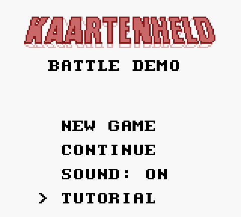

# KAARTENHELD

### Player's Guide

**Welcome, hero!** A dark shadow has fallen over the land, and only you can
lift it — not with a sword and shield, but with a **deck of magical cards**.

This little book shows you how to walk, talk, battle, and win. Take your
time. The land can wait a few more minutes.

---

## 1. The Story

Once the land was peaceful. Then the **monsters** came — slimes, bats,
spiders, and worse — and now only one brave hero can push them back.

Your cards are your courage. Every battle is a card duel, and if you play
your cards well, you can beat any monster.

But far away, behind the old castle walls, the biggest monster of all is
waiting: the **Lord of Slimes**. Beat him, and the land is free.

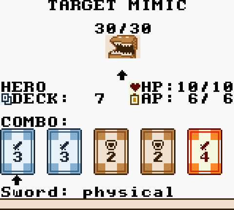

---

## 2. Starting the Game

Turn on your Game Boy and you will see the **title screen**:

Press **START**, then choose from the menu:

| Menu | What it does |
|---|---|
| **NEW GAME** | Start a brand-new adventure. |
| **CONTINUE** | Load a game you saved earlier. |
| **SOUND: ON/OFF** | Turn the music on or off. |
| **TUTORIAL** | A short, friendly how-to-play lesson. |

**Tip:** if you have never played before, pick **TUTORIAL** first!

---

## 3. The Controls

| Button | What it does |
|---|---|
| **D-Pad** | Walk around. Hold it down to keep walking. |
| **A** | Talk, open, confirm, or use what is in front of you. |
| **B** | Go back or cancel. In battle, it also *flees*. |
| **START** | Open your **Cards & Quests** screen. |
| **SELECT** | Open the **Load Game** screen. |

Inside menus, **LEFT** and **RIGHT** switch pages, **UP** and **DOWN** move
the pointer, **A** chooses, and **B** backs out.

---

## 4. Walking the World

The land is a great big map made of little squares. Walk to the edge and
step on a gate arrow (`>` or `<`) to travel to the next place.

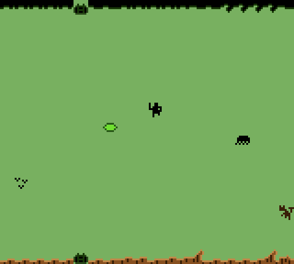

Here is a friendly town on your journey:

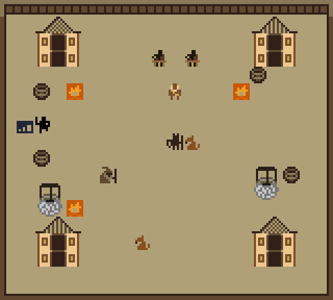

Along the way you will meet lots of characters. Stand in front of someone
and press **A** to talk.

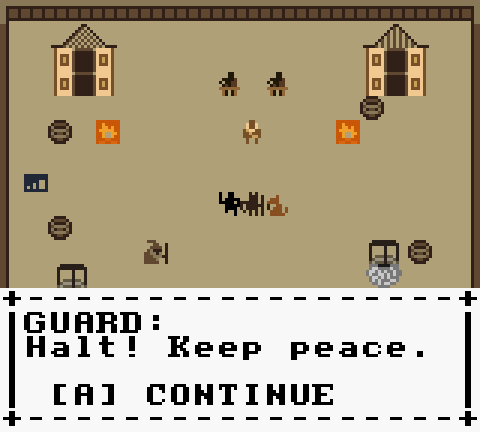

- **Signposts** teach you things. Read every one!
- **Kind helpers** — a hermit, a scout, a knight — share hints.
- **Monsters** wander the wilds. Touch one and a battle begins!

---

## 5. Your Quest

### The Monster Hunt

Talk to the **Mayor** in town. He asks you to defeat **3 monsters**.

When you have beaten all three, go back to him and he will give you a
wonderful prize: the **Iron Sword** card. Then he warns you that something
dreadful waits at the castle.

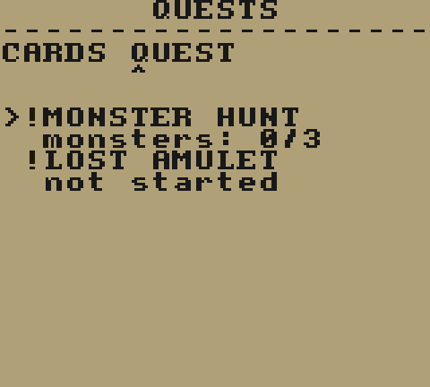

### The Lost Amulet

The **Lost Merchant** in town has lost his family treasure. It is hiding
somewhere in the **Forest**.

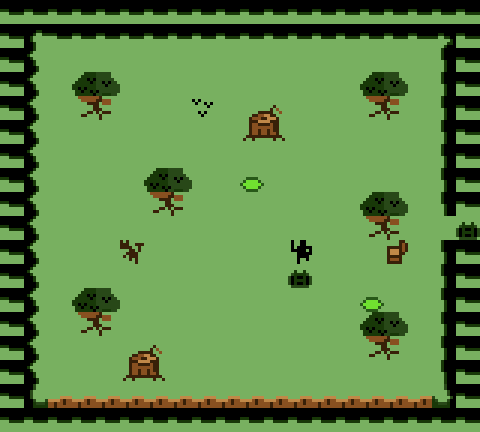

Find it, bring it back, and he will thank you with **15 gold** — and open
his shop for you.

---

## 6. Your Cards

Everything you need to win is written on a card. A card shows:

- its **name** and a picture,
- a **symbol** like `SW` (sword) or `SH` (shield),
- and a **number** called its **power**.

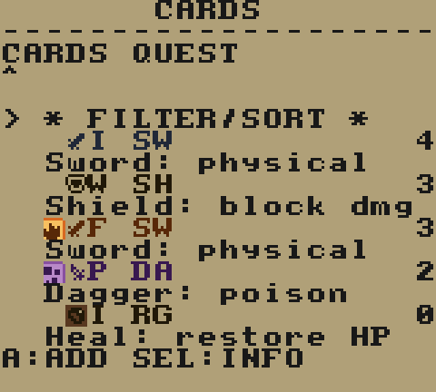

Here is the card list up close. The number on the right is how many copies
you own:

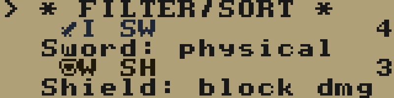

### The five kinds of cards

| Card | What it does |
|---|---|
| **Sword** (`SW`) | Hurts the monster. |
| **Shield** (`SH`) | Blocks damage when the monster attacks. |
| **Bow** (`BO`) | Hurts from far away. The mighty Mythril Bow costs extra Energy. |
| **Ring / Heal** (`HE`) | Heals your health. Rings are also wild jokers! |
| **Dagger** (`DA`) | A small hit that can poison. |

Some cards are extra special: a **Fire Sword** burns, a **Poison Dagger**
poisons, and the **Mythril Bow** hits very, very hard.

### Collection and deck

The cards you **own** are your **collection**. The cards you actually
**bring to battle** are your **deck**.

Open your Cards screen with **START**, then press **A** on a card to add it
to your deck. You start with **12 cards**, and your deck can grow to
**20**.

---

## 7. A Battle Begins

When a battle starts, you will see the battlefield:

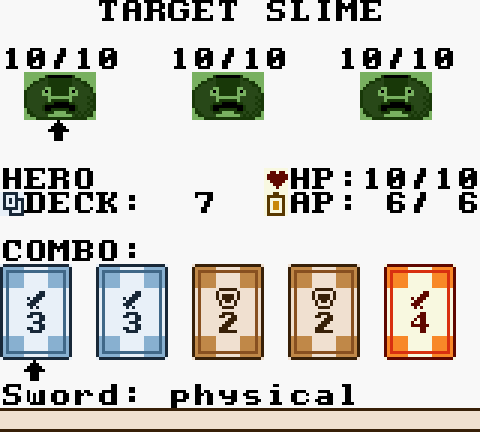

The top shows the monsters and their health. The bottom shows **you**, your
deck, your Energy, and your **hand** of cards.

A battle goes around and around in four steps.

### Step 1 — Choose your attack

Pick the cards you want to use, then press **SELECT** to play them. You can
play up to **5** cards at once.

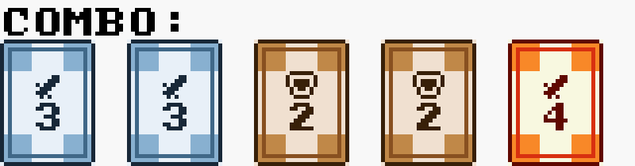

Every card costs **Energy**. You get **6 Energy** each round, so spend it
carefully!

### Step 2 — Watch your attack

Your hero attacks with the cards you chose. A better *combo* means a bigger
hit (see the next page).

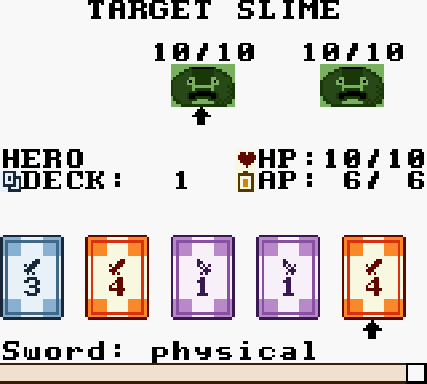

### Step 3 — The monster gets ready

The monster shows you which card it will attack with. That card's number is
how much damage is coming, so get ready to block it!

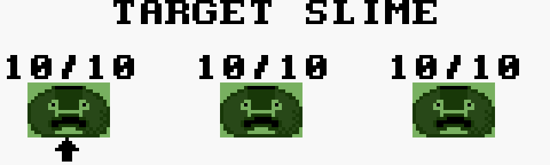

### Step 4 — Defend!

Now play your **Shield** cards to block. Any damage left over hurts you.

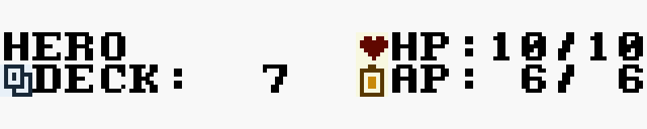

Then the round starts again. Keep going until the monsters — or you — run
out of health!

> **Hurry!** A timer bar drains at the bottom of the screen. If it runs all
> the way down, you will play whatever cards you have already chosen, so
> decide quickly!

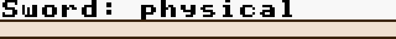

---

## 8. Combos: Play Poker!

Here is the big secret: **the cards in your hand are like a poker hand!**
The more alike your cards are, the stronger your attack becomes.

| Combo | You have... |
|---|---|
| **Pair** | Two cards of the same number |
| **Two Pair** | Two pairs |
| **Three of a Kind** | Three cards of the same number |
| **Straight** | Five numbers in a row |
| **Flush** | Five cards of the same kind |
| **Full House** | Three of a kind plus a pair |
| **Four of a Kind** | Four cards of the same number |
| **Straight Flush** | A straight, all in one kind |
| **Five of a Kind** | All five cards the same number! |

The higher the combo, the harder you hit. Try to build the best hand you
can!

**Rings are jokers.** A Ring can pretend to be any number you need — a
great way to finish a combo.

---

## 9. Shields, Heals and Curses

- **Shields** only block. They do not hurt the monster, but they keep you
  safe — and they still count toward your combo.
- **Rings** heal you, or act as wild shields on defence.
- **Poison** and **Burn** hurt a little every turn. Watch the little marks
  beside a fighter.
- **Freeze** is nasty: a frozen fighter **misses a whole turn!**
- When you are **poisoned**, a couple of your cards turn grey and cannot be
  used until the poison wears off.

---

## 10. Gold and Shops

Win battles to earn **gold**. You start with **20 gold**.

Talk to the **Shopkeeper** in town to spend it:

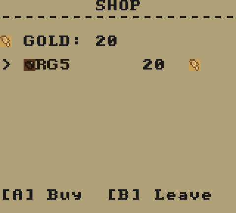

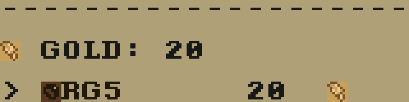

Press **A** to buy and **B** to leave. The Shopkeeper sells a **Healing
Ring** — your best friend when you are hurt.

Later, the **Lost Merchant** opens a bigger shop with an **Iron Sword** and
a powerful **Mythril Bow**.

---

## 11. Card Loot

Every monster you beat drops **one card**, and no two are quite the same.

You can:

- **Keep it** in your collection,
- **Add it** to your deck to make yourself stronger,
- or **sell it** for gold when a merchant is nearby.

It is like a treasure hunt that never ends!

---

## 12. Saving Your Game

Find the **Wizard** in town. He can save your adventure to one of **three
slots**.

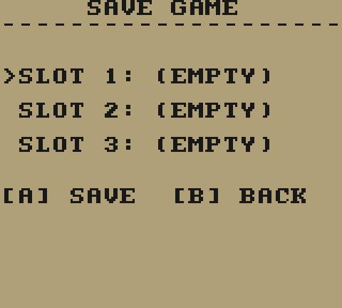

Choose a slot and press **A**. Your Game Boy remembers even after you turn
it off, so you can always come back later.

To load a game, press **SELECT** while walking around, or choose
**CONTINUE** on the title screen.

---

## 13. Winning and Losing

- **Win a battle** when every monster is defeated. Then you will find out
  what card you discovered!
- **Lose a battle** if your health reaches zero. You will see the **GAME
  OVER** screen:
  - **YES** — go back and load a saved game.
  - **NO** — say goodbye and stop playing.

Beat the **Lord of Slimes** in the Throne Room and you will see the happy
ending. The land is saved, thanks to you!

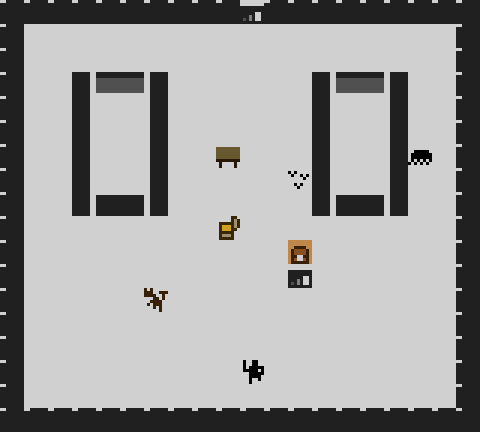

---

## 14. Tips & Tricks

- **Read the signposts** — they tell you real secrets.
- **Only Shields block.** Save your shields for defence.
- **Rings are wild!** Keep one for a combo or a heal.
- **Watch your Energy.** Six points a round goes fast.
- **Do not waste your timer.** Decide, then press **SELECT**.
- **Beat the 3 monsters early** to win the Iron Sword.
- **Sell cards you do not need** and buy a Healing Ring.
- **Save often** at the Wizard — you never know what is around the corner!

---

## 15. Quick Reference

| | |
|---|---|
| Your health | **10 HP** |
| Starting gold | **20** |
| Cards in hand | **5** |
| Energy each round | **6** |
| Time to decide | **20 seconds** |
| Starter deck | **12 cards** |
| Biggest deck | **20 cards** |
| Collection limit | **12 different cards** |
| Main quest | Defeat **3 monsters** for the Mayor |

Now go, hero — the cards are in your hands!
